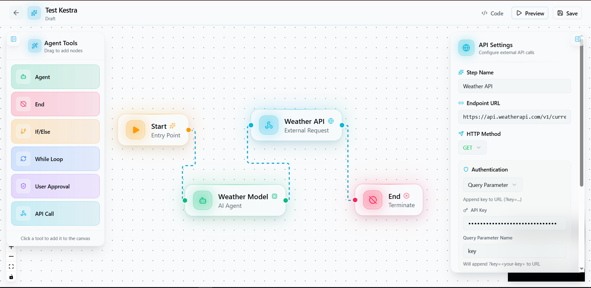

<div align="center">
  
  
  # Triggr
  
  ### 🤖 AI-Powered Visual Workflow Automation Platform

  [](https://nextjs.org/)
  [](https://react.dev/)
  [](https://www.typescriptlang.org/)
  [](https://www.convex.dev/)
  [](https://kestra.io/)
  [](https://clerk.dev/)

  *Build, test, and deploy intelligent AI agents with an intuitive visual builder — no boilerplate required.*

  [🚀 Get Started](#-getting-started) • [✨ Features](#-features) • [📖 Documentation](#-documentation) • [🏗️ Architecture](#️-architecture)

</div>

---

## 📋 Table of Contents

- [Overview](#-overview)
- [Features](#-features)
- [Node Types](#-node-types)
- [Technology Stack](#-technology-stack)
- [Getting Started](#-getting-started)
- [Environment Variables](#-environment-variables)
- [API Endpoints](#-api-endpoints)
- [Kestra Integration](#-kestra-integration)
- [Architecture](#️-architecture)
- [Project Structure](#-project-structure)
- [How It Works](#-how-it-works)

---

## 🌟 Overview

**Triggr** is a visual AI agent workflow builder that allows users to design, test, and deploy automation workflows using a drag-and-drop interface. It bridges the gap between designing AI workflows and running them in production by integrating with [Kestra](https://kestra.io), an open-source orchestration platform.

### The Problem
- Workflows often exist only as visual diagrams with no way to execute them
- No scheduling, monitoring, or error handling for automations
- Complex setup required to integrate AI models with external APIs

### The Solution
Triggr transforms your visual workflow designs into production-ready automations:
- **Visual Builder** → Design workflows with drag-and-drop
- **Preview & Test** → Chat with your AI agents in real-time
- **Deploy to Kestra** → One-click deployment to production orchestration
- **Monitor & Scale** → Track executions, handle errors, and scale automatically

---

## ✨ Features

### 🎨 Visual Workflow Editor
- **Drag-and-drop interface** powered by [React Flow](https://reactflow.dev/)
- **Real-time node connections** with animated edges
- **Customizable node settings** with detailed configuration panels
- **Auto-save** workflow progress to Convex database

### 🤖 AI Agent Nodes
- Support for multiple AI providers via **OpenRouter**:
  - Google Gemini (1.5 Flash, 2.5 Flash)
  - OpenAI GPT (GPT-4o, GPT-4o Mini, GPT-4.1 Nano)
  - xAI Grok 3 Mini
- Configurable **system prompts** and instructions
- **Conversation history** inclusion option
- **JSON or Text output** modes

### 🔗 API Integrations
- **HTTP methods**: GET, POST, PUT, PATCH, DELETE
- **Authentication types**: Bearer Token, Query Parameter, Custom Header
- **Dynamic URL parameters** with placeholder replacement
- **Custom headers** and request body configuration

### 🎮 Workflow Preview & Testing
- **Live chat interface** to test your AI agents
- **Real-time tool execution** and API calls
- **Conversation history** management
- **Debug logs** for troubleshooting

### 🚀 Kestra Orchestration Integration
- **Automatic YAML generation** from visual workflows
- **One-click deployment** to Kestra
- **Workflow execution** with input parameters
- **Execution status monitoring**
- **KV Store integration** for secure API key management

### 🔐 Authentication & Security
- **Clerk authentication** for user management
- **Protected routes** with middleware
- **Rate limiting** via Arcjet (5000 tokens/30 days)
- **Secure API key storage** in Kestra KV Store

### 📊 Dashboard
- **Agent management** - Create, view, and edit agents
- **Workflow overview** with execution stats
- **Quick actions** for common tasks
- **Responsive sidebar navigation**

---

## 🧩 Node Types

Triggr provides 7 different node types for building complex AI workflows:

| Node | Description | Settings |
|------|-------------|----------|
| 🟢 **Start Node** | Entry point of every workflow | None |
| 🤖 **Agent Node** | AI-powered processing node | Name, Instruction, Model, Include History, Output Type (Text/JSON), Schema |
| 🔗 **API Node** | External HTTP API calls | Name, Endpoint, Method, Headers, Body, Auth Type, API Key |
| 🔀 **If/Else Node** | Conditional branching | Condition expression |
| 🔄 **While Node** | Loop execution | While condition |
| ✅ **User Approval Node** | Human-in-the-loop checkpoint | Name, Message |
| 🔴 **End Node** | Terminates workflow execution | Output Schema |

### Node Configuration Details

#### Agent Node Settings
```typescript
{
  name: string;           // Agent display name
  instruction: string;    // System prompt/instructions
  includeHistory: boolean; // Include conversation history
  model: string;          // AI model (e.g., 'google/gemini-1.5-flash')
  output: 'Text' | 'Json'; // Output format
  schema: string;         // JSON schema for structured output
}
```

#### API Node Settings
```typescript
{
  name: string;           // Step name
  endpoint: string;       // API URL (supports {param} placeholders)
  method: 'GET' | 'POST' | 'PUT' | 'PATCH' | 'DELETE';
  headers: string;        // JSON headers
  body: string;           // Request body (for POST/PUT/PATCH)
  authType: 'none' | 'bearer' | 'query' | 'header';
  apiKey: string;         // API key value
  apiKeyName: string;     // Key name for query/header auth
}
```

---

## 🛠 Technology Stack

### Frontend
| Technology | Purpose |
|------------|---------|
| [Next.js 15.5](https://nextjs.org/) | React framework with App Router |
| [React 19.1](https://react.dev/) | UI library |
| [TypeScript 5](https://www.typescriptlang.org/) | Type safety |
| [Tailwind CSS 4](https://tailwindcss.com/) | Styling |
| [Framer Motion](https://www.framer.com/motion/) | Animations |
| [React Flow](https://reactflow.dev/) | Visual workflow editor |
| [Radix UI](https://www.radix-ui.com/) | Accessible UI components |
| [Lucide Icons](https://lucide.dev/) | Icon library |

### Backend & Database
| Technology | Purpose |
|------------|---------|
| [Convex](https://www.convex.dev/) | Real-time database & backend |
| [Kestra](https://kestra.io/) | Workflow orchestration engine |
| [OpenRouter](https://openrouter.ai/) | AI model gateway |
| [OpenAI SDK](https://platform.openai.com/) | AI integrations |

### Authentication & Security
| Technology | Purpose |
|------------|---------|
| [Clerk](https://clerk.dev/) | Authentication & user management |
| [Arcjet](https://arcjet.com/) | Rate limiting & bot protection |

### Additional Libraries
- **axios** - HTTP client
- **zod** - Schema validation
- **react-hook-form** - Form handling
- **sonner** & **react-hot-toast** - Notifications
- **uuid** - Unique ID generation
- **date-fns** & **moment** - Date utilities

---

## 🚀 Getting Started

### Prerequisites
- Node.js 18+ 
- npm, yarn, pnpm, or bun
- Convex account
- Clerk account
- OpenRouter or OpenAI API key
- (Optional) Kestra instance for deployment

### Installation

1. **Clone the repository**
   ```bash
   git clone https://github.com/Arjunhg/triggr.git
   cd triggr
   ```

2. **Install dependencies**
   ```bash
   npm install
   # or
   yarn install
   # or
   pnpm install
   ```

3. **Set up environment variables**
   ```bash
   cp .env.example .env.local
   ```
   Fill in the required environment variables (see [Environment Variables](#-environment-variables))

4. **Initialize Convex**
   ```bash
   npx convex dev
   ```

5. **Run the development server**
   ```bash
   npm run dev
   ```

6. **Open the app**
   Navigate to [http://localhost:4000](http://localhost:4000)

---

## 🔐 Environment Variables

Create a `.env.local` file with the following variables:

```env
# Clerk Authentication
NEXT_PUBLIC_CLERK_PUBLISHABLE_KEY=pk_test_xxx
CLERK_SECRET_KEY=sk_test_xxx
NEXT_PUBLIC_CLERK_SIGN_IN_URL=/sign-in
NEXT_PUBLIC_CLERK_SIGN_UP_URL=/sign-up

# Convex Database
CONVEX_DEPLOYMENT=dev:xxx
NEXT_PUBLIC_CONVEX_URL=https://xxx.convex.cloud

# AI Providers (at least one required)
OPENROUTER_API_KEY=sk-or-xxx
OPENAI_API_KEY=sk-xxx

# Kestra Orchestration (optional)
KESTRA_URL=http://localhost:8080
KESTRA_USERNAME=admin@kestra.io
KESTRA_PASSWORD=kestra

# Arcjet Rate Limiting
ARCJET_KEY=ajkey_xxx
```

---

## 📡 API Endpoints

### Agent Chat
**POST** `/api/agent-chat`

Execute AI agent workflow with chat interface.

```typescript
// Request
{
  input: string;           // User message
  agentToolConfig: object; // Generated agent configuration
  conversationId?: string; // Optional conversation ID
}

// Response
{
  response: string;        // AI response
  conversationId: string;  // Conversation ID
}
```

### Generate Agent Tool Config
**POST** `/api/agent-tool-config`

Convert workflow configuration to executable agent config.

```typescript
// Request
{
  jsonConfig: {
    startNode: string;
    flow: FlowNode[];
  }
}

// Response - AgentToolConfig
{
  systemPrompt: string;
  primaryAgentName: string;
  agents: Agent[];
  tools: Tool[];
}
```

### Generate JavaScript Code
**POST** `/api/generate-code`

Generate executable JavaScript from workflow.

```typescript
// Request
{
  flowConfig: object;  // Workflow configuration
}

// Response
{
  code: string;        // Generated JavaScript code
}
```

### Kestra Integration

#### Generate Kestra YAML
**POST** `/api/kestra/generate`

Convert workflow to Kestra YAML format.

```typescript
// Request
{
  nodes: NodeType[];
  edges: EdgeType[];
  flowId: string;
  namespace?: string;
}

// Response
{
  yaml: string;        // Kestra YAML workflow
}
```

#### Deploy to Kestra
**POST** `/api/kestra/deploy`

Deploy YAML workflow to Kestra instance.

```typescript
// Request
{
  yaml: string;        // Kestra YAML workflow
}

// Response
{
  success: boolean;
  flowId: string;
  namespace: string;
  revision: number;
}
```

#### Execute Kestra Flow
**POST** `/api/kestra/execute`

Execute a deployed Kestra workflow.

```typescript
// Request
{
  namespace: string;
  flowId: string;
  inputs?: Record<string, any>;
}

// Response
{
  success: boolean;
  executionId: string;
  state: string;
}
```

#### Check Execution Status
**GET** `/api/kestra/status?executionId=xxx`

Get execution status and results.

```typescript
// Response
{
  executionId: string;
  state: string;
  tasks: TaskStatus[];
  outputs: any;
}
```

### Rate Limiting
**GET** `/api/arcjet`

Protected endpoint demonstrating Arcjet rate limiting.

---

## 🔄 Kestra Integration

Triggr integrates with [Kestra](https://kestra.io) to transform visual workflows into production-ready orchestrated automations.

### Why Kestra?

| Without Kestra | With Kestra |
|----------------|-------------|
| Workflows only exist as diagrams | Workflows execute in production |
| No scheduling capability | Cron, event, or API triggers |
| No execution history | Full monitoring & logs |
| No error handling | Automatic retries & error management |
| Cannot scale | Thousands of concurrent executions |

### Setup Kestra

1. **Start Kestra** (using Docker):
   ```bash
   docker run --pull=always --rm -it -p 8080:8080 \
     --user=root \
     -v /var/run/docker.sock:/var/run/docker.sock \
     -v /tmp:/tmp \
     kestra/kestra:latest-full server local
   ```

2. **Access Kestra UI**: [http://localhost:8080](http://localhost:8080)

3. **Configure KV Store** for API keys:
   ```bash
   # Set OpenRouter API Key
   curl -X PUT -H "Content-Type: application/json" \
     http://localhost:8080/api/v1/main/namespaces/triggr.workflows/kv/OPENROUTER_API_KEY \
     -d '"your-api-key-here"'
   ```

### Workflow Conversion

Triggr automatically converts visual nodes to Kestra tasks:

| Triggr Node | Kestra Task |
|-------------|-------------|
| Start Node | `io.kestra.plugin.core.log.Log` |
| Agent Node | `io.kestra.plugin.ai.completion.ChatCompletion` |
| API Node | `io.kestra.plugin.core.http.Request` |
| If/Else Node | `io.kestra.plugin.core.flow.Switch` |
| While Node | `io.kestra.plugin.core.flow.ForEach` |
| End Node | `io.kestra.plugin.core.log.Log` |

---

## 🏗️ Architecture

```
┌─────────────────────────────────────────────────────────────────┐
│                         TRIGGR APP                              │
│                                                                 │
│  ┌──────────────┐  ┌──────────────┐  ┌──────────────┐           │
│  │   Landing    │  │  Dashboard   │  │Agent Builder │           │
│  │    Page      │  │   (List)     │  │  (Editor)    │           │
│  └──────────────┘  └──────────────┘  └──────────────┘           
│         │                 │                 │                   │
│         └─────────────────┼─────────────────┘                   │
│                           │                                     │
│  ┌────────────────────────┴────────────────────────┐            │
│  │              React Flow Canvas                  │            │
│  │  ┌────┐ ┌────┐ ┌────┐ ┌────┐ ┌────┐ ┌────┐      │            │
│  │  │Start│→│Agent│→│API │→│If/ │→│Loop│→│End │    │            │
│  │  │Node │ │Node │ │Node│ │Else│ │Node│ │Node│    │            │
│                           │                                    │
└───────────────────────────┼────────────────────────────────────┘
                            │
        ┌───────────────────┼───────────────────┐
        │                   │                   │
        ▼                   ▼                   ▼
┌──────────────┐   ┌──────────────┐   ┌──────────────┐
│   Convex     │   │  OpenRouter  │   │   Kestra     │
│  Database    │   │   AI APIs    │   │ Orchestrator │
│              │   │              │   │              │
│ • Users      │   │ • Gemini     │   │ • Deploy     │
│ • Agents     │   │ • GPT-4      │   │ • Execute    │
│ • Workflows  │   │ • Grok       │   │ • Monitor    │
└──────────────┘   └──────────────┘   └──────────────┘
```

---
## 🔄 How It Works

### End-to-End Workflow

```
1. CREATE AGENT
   User clicks "New Workflow" → Names the agent → Agent created in Convex
   
2. BUILD WORKFLOW
   Drag nodes from panel → Connect with edges → Configure node settings
   
3. SAVE WORKFLOW
   Click "Save" → Nodes & edges stored in Convex → Auto-synced
   
4. GENERATE CONFIG
   Click "Preview" → System generates AgentToolConfig from workflow
   
5. TEST IN PREVIEW
   Chat with AI agent → Real-time API calls → Tool execution
   
6. EXPORT TO KESTRA (Optional)
   Click "Code" → Switch to "Kestra YAML" → Deploy to Kestra
   
7. PRODUCTION EXECUTION
   Kestra runs workflow → Scheduling, retries, monitoring available
```

### Data Flow

```
User Action → React Component → Context Update → Convex Mutation → Database
                                                        ↓
Database → Convex Query → React Component → UI Update
```

### AI Execution Flow

```
User Input → Agent Chat API → Build Messages → OpenRouter/OpenAI
                                    ↓
Tool Calls Required? → Execute Tools → Aggregate Results
                                    ↓
                          Final AI Response → User
```

---

## 📖 Documentation

- [Kestra Integration Guide](https://kestra.io/docs/getting-started/quickstart#start-kestra) - Detailed Kestra setup and usage
- [OpenRouter Models](https://openrouter.ai/models) - Available AI models
- [React Flow Docs](https://reactflow.dev/docs) - Visual editor documentation
- [Convex Docs](https://docs.convex.dev/) - Database documentation
- [Clerk Docs](https://clerk.com/docs) - Authentication documentation

---

## 🤝 Contributing

Contributions are welcome! Please feel free to submit a Pull Request.

1. Fork the repository
2. Create your feature branch (`git checkout -b feature/AmazingFeature`)
3. Commit your changes (`git commit -m 'Add some AmazingFeature'`)
4. Push to the branch (`git push origin feature/AmazingFeature`)
5. Open a Pull Request

---

## 📄 License

This project is licensed under the MIT License - see the [LICENSE](LICENSE) file for details.

---

<div align="center">
  <p>Built with ❤️ for automation</p>
  <p>
    <a href="https://github.com/yourusername/triggr">⭐ Star this repo</a> •
    <a href="https://github.com/yourusername/triggr/issues">🐛 Report Bug</a> •
    <a href="https://github.com/yourusername/triggr/issues">💡 Request Feature</a>
  </p>
</div>

